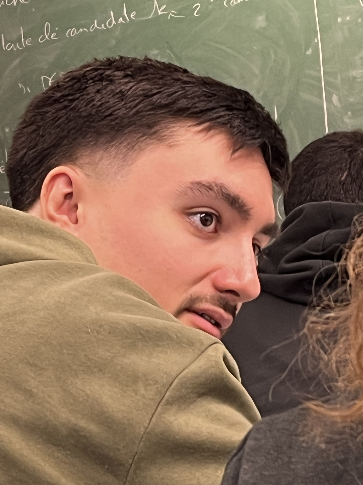

<h1 align="center">
   <b>
         
    </b>
</h1>

# Développeurs

 |  |  |  |
--- | --- | --- | --- |
Chef de projet | Codeur | Chercheur | Codeur |
CORNEJO, Oscar, 22305517 | KASHI, Mohand-Hedi, 220051070 | MOUSSSAOUI, Iness, 22006171 | JOLY, Thomas, 21916099 |

# Description

Projet dans lequel on veut implémenter un site web permettant de partager ses recettes de cuisines avec les autres utlisateurs. De nombreux paramètres de recherches sont disponibles pour ffectuer des recherches précises (prix, quantité, temps, allergie) . Le site aura aussi un espace commentaire permettant de partager ses differents avis sur les differentes espaces disponibles aux utilisateurs . Chaque semaine le site affichera une recette de la semaine permettant de faire decouvrir de nouvelles recettes aux utilisateurs.

# Table de contenu

- [Développeurs](#développeurs)
- [Description](#description)
- [Table de contenu](#table-de-contenu)
  - [Description de l'aplication](#description-de-laplication)
  - [Progrès réalisés à ce jour](#progrès-réalisés-à-ce-jour)
  - [Références](#références)
  - [Problèmes rencontrées/solutions trouvées](#problèmes-rencontréessolutions-trouvées)
  - [Mise à jour du calendrier](#mise-à-jour-du-calendrier)
  - [Rôles pour le prochain sprint](#rôles-pour-le-prochain-sprint)

## Description de l'aplication

Nous avons décidé de créer un site web de recettes de cuisine qui permettra aux utilisateurs de pouvoir trouver des recettes adaptées selon leurs envies et leurs finances . Pour cela nous avons personnifié les paramètres disponibles pour une meilleure utilisation pour les utilisateurs (prix, ingrédients , temps, ..) . Nous avons immédiatement pensé au côté partage, en créant une partie réseaux sociaux ou les gens qui sont identifiés sur le site web pourront commenter, partager et communiquer leurs recettes .

Nous avons d’abord cherché un symbole pour représenter notre site. Pour trouver une image libre de droits, nous avons utilisé l'IA Microsoft Copilot qui nous a donné un design sans copyright.

## Progrès réalisés à ce jour

Nous commençons par choisir l’architecture de code à utiliser. Pour cela, l’architecture Modèle, Vue, Contrôleur a été choisie. Parce que le code est basé sur des écrans et qu’il n’a pas une architecture aussi robuste. 
De plus, la stack choisie a été la stack MERN (MongoDB, Express, React, Nodejs), qui est très utile en termes de documentation et est actuellement l'une des stacks les plus utilisées, de plus il existe une grande communauté pour résoudre les problèmes. Et il y a la possibilité d'utiliser des packages créés par la communauté, ce qui réduit le temps de développement des applications web.
	Pour réaliser le design de notre site web, nous avons choisi d’utiliser Figma. C’est un site permettant de créer le design et le prototype d'une application. Il nous permet également de travailler tous ensemble sur un même projet en même temps. 
Nous avons d’abord commencé par choisir une palette de couleurs, une police d’écriture etquelques boutons que l’on utilisera sur toutes les pages de notre site web afin d’obtenir un résultat uniforme et cohérent. Ensuite nous avons défini toutes les pages que notre site web contiendra et nous nous sommes réparti le travail. Notre site web comprendra donc une page de connexion et d’inscription, une page d'accueil où le site recommande des recettes phare, une page permettant de rechercher des recettes et une page profil utilisateur. Une fois toutes les pages réalisées, nous sommes revenus tous ensemble sur ces dernières pour effectuer les choix finaux concernant l’aspect de notre site web. Nous avons ensuite travaillé ensemble pour réaliser une maquette de notre base de données. Nous avons également fait l’UML de cette base de données ce qui nous permettra de l’implémenter plus facilement par la suite.

Lien vers le site de design en Figma:

https://www.figma.com/file/3tYEf26leCO5v0TsYompBH/CookApp?type=design&node-id=0-1&mode=design&t=hq0dGaHQoiCk5l1P-0/ 

## Références

https://www.cuisineaz.com/  Nous avons utilisé ce site pour chercher des recettes culinaires diverses et variées et pour s’inspirer de l’interface. 

https://www.marmiton.org/  Ce site nous a permis de trouver différentes recettes et de s’en inspirer pour la présentation. 

https://appmaster.io/fr/blog/bases-de-donnees-sql-et-nosql Ce site montre les différences entre une base de données SQL et une Base de données NoSQL. 

https://copilot.microsoft.com/?wlexpsignin=1  Lien de l’IA utilisé pour générer le logo et certaines images. 

https://www.figma.com/ Le lien de figma design ou nous avons réaliser notre maquette
 
https://radixweb.com/blog/full-stack-vs-mean-stack-vs-mern-stack-development Site utile pour prendre la décision quelle stack utiliser en fonction de nos besoins

## Problèmes rencontrées/solutions trouvées

Il y avait des problèmes de cohérence des designs entre les tabs de chaque membre. C'est-à-dire : 
- Certains attributs qui n'étaient pas inclus dans d'autres tabs
- Conception des Components
- Mise en page générale

Ces problèmes ont été résolus en réutilisant des components fabriqués par d'autres membres du groupe et lors d'une réunion où la conception du design et la définition des tables et des attributs de la base de données, ainsi que son diagramme UML, ont été standardisés.

## Mise à jour du calendrier

## Rôles pour le prochain sprint

Chef de projet: MOUSSSAOUI Iness 

Codeurs :  JOLY Thomas, CORNEJO Oscar 

Chercheur : KASHI Mohand-Hedi