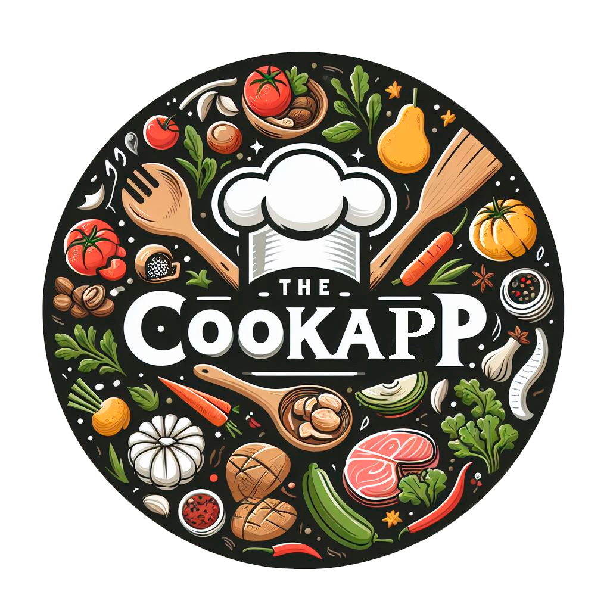
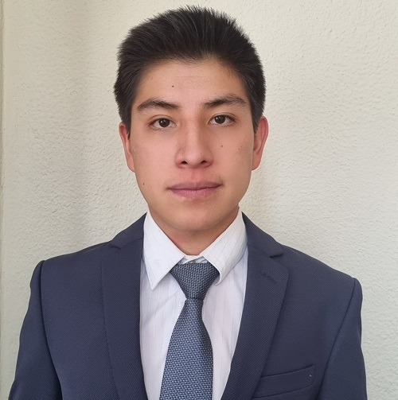
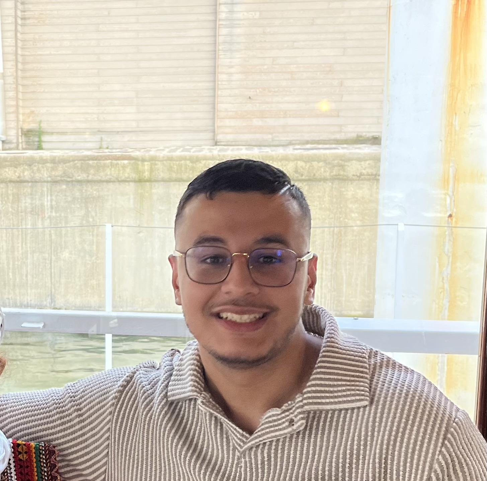
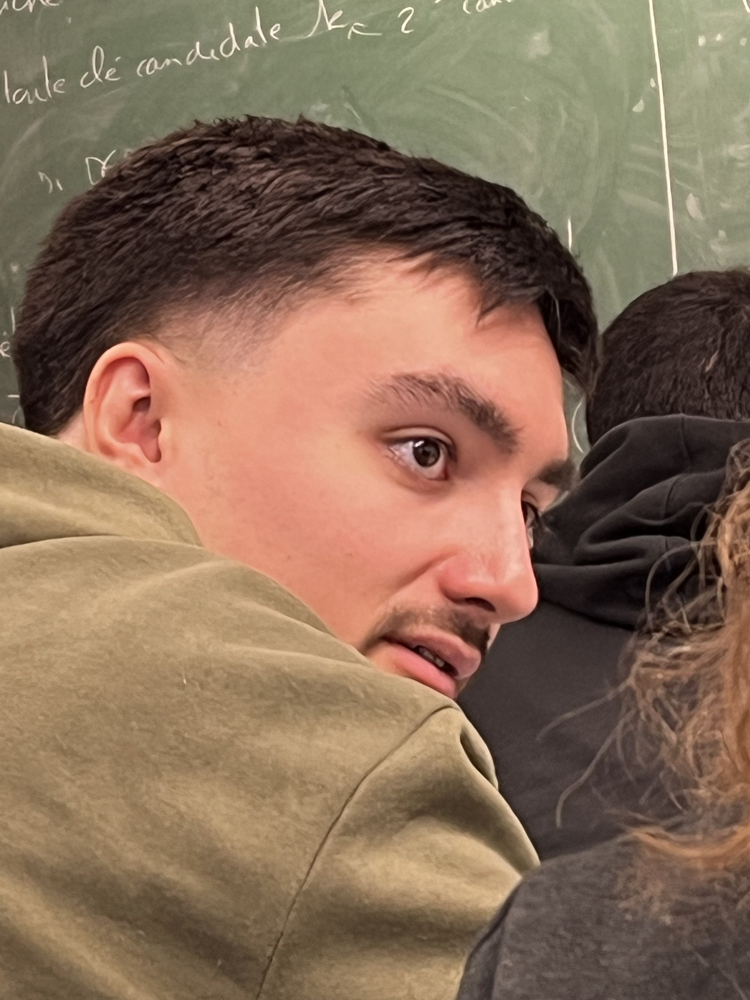
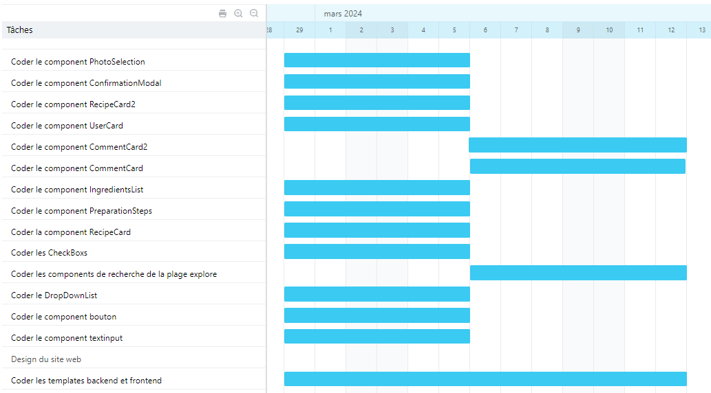

<h1 align="center">
   <b>
         
    </b>
</h1>

# Développeurs

 |  |  |  |
--- | --- | --- | --- |
Codeur | Chercheur | Chef de projet | Codeur |
CORNEJO, Oscar, 22305517 | KASHI, Mohand-Hedi, 220051070 | MOUSSSAOUI, Iness, 22006171 | JOLY, Thomas, 21916099 |

# Description

Projet dans lequel on veut implémenter un site web permettant de partager ses recettes de cuisine avec les autres utilisateurs. De nombreux paramètres de recherches sont disponibles pour effectuer des recherches précises (prix, quantité, temps, allergie) . Le site aura aussi un espace commentaire permettant de partager ses différents avis sur les différents espaces disponibles aux utilisateurs . Chaque semaine le site affiche une recette de la semaine permettant de faire découvrir de nouvelles recettes aux utilisateurs.

# Table de contenu

- [Développeurs](#développeurs)
- [Description](#description)
- [Table de contenu](#table-de-contenu)
  - [Description de l'application](#description-de-lapplication)
  - [Progrès réalisés à ce jour](#progrès-réalisés-à-ce-jour)
  - [Références](#références)
  - [Problèmes rencontrées/solutions trouvées](#problèmes-rencontréessolutions-trouvées)
  - [Mise à jour du calendrier](#mise-à-jour-du-calendrier)
  - [Rôles pour le prochain sprint](#rôles-pour-le-prochain-sprint)

## Description de l'application

Nous avons décidé de créer un site web de recettes de cuisine qui permettra aux utilisateurs de pouvoir trouver des recettes adaptées selon leurs envies et leurs finances . Pour cela nous avons personnifié les paramètres disponibles pour une meilleure utilisation pour les utilisateurs (prix, ingrédients , temps, ..) . Nous avons immédiatement pensé au côté partage, en créant une partie réseaux sociaux ou les gens qui sont identifiés sur le site web pourront commenter, partager et communiquer leurs recettes .

Nous avons d’abord cherché un symbole pour représenter notre site. Pour trouver une image libre de droits, nous avons utilisé l'IA Microsoft Copilot qui nous a donné un design sans copyright.

## Progrès réalisés à ce jour

Nous avons codés les composantes principales de notre application. Ces composantes forment la structure de base de notre application et définissent son fonctionnement général. Ils restent donc fixés et ne subiront pas de modifications majeures.
Par exemple, prenons la liste des ingrédients dans notre application. Bien que le contenu de cette liste (c’est-à-dire les ingrédients eux-mêmes) puisse changer en fonction des besoins de l’utilisateur ou des recettes spécifiques, le format et la structure de la liste restent les mêmes. Cela signifie que peu importe les ingrédients que nous ajoutons ou supprimons, la manière dont nous stockons, récupérons et manipulons ces ingrédients dans notre base de données reste constante. Cela nous permet de maintenir une cohérence dans notre code et de faciliter la maintenance et l’évolution de notre application. De la même manière, nous avons codé les components : button, textinput, dropdownlist, tabs, usercar, recipecard, commentcar, confirmationmodal, explorecard, listitem, photoselection et preparationsteps.

Nous avons également fait le serveur Backend, nous avons mis en place les routes et les contrôleurs et nous avons créé les différentes tables 
Lien vers le site de design en Figma:

https://www.figma.com/file/3tYEf26leCO5v0TsYompBH/CookApp?type=design&node-id=0-1&mode=design&t=hq0dGaHQoiCk5l1P-0/

## Références 

https://github.com/ 

https://docs.github.com/fr/pull-requests/collaborating-with-pull-requests/addressing-merge-conflicts/resolving-a-merge-conflict-on-github 

https://www.geeksforgeeks.org/mvc-framework-introduction/ 

https://mongoosejs.com/docs/guide.html

https://react.dev/reference/react 

## Problèmes rencontrées/solutions trouvées

Les conflits au moment du merge vers le main. 
Solution trouvée : réunion avec tout le monde afin de solutionner les problèmes de conflits entre les différentes versions du code.

Lors de l’importe de la photo les dimensions ne correspondaient pas au cadre de notre composante. 

Solution trouvée : redimensionner l’image 

## Mise à jour du calendrier

## Rôles pour le prochain sprint

Chef de projet:  Kashi Mohand-Hedi

Codeurs : Moussaoui Iness, Cornejo Oscar

Chercheur : Joly Thomas
