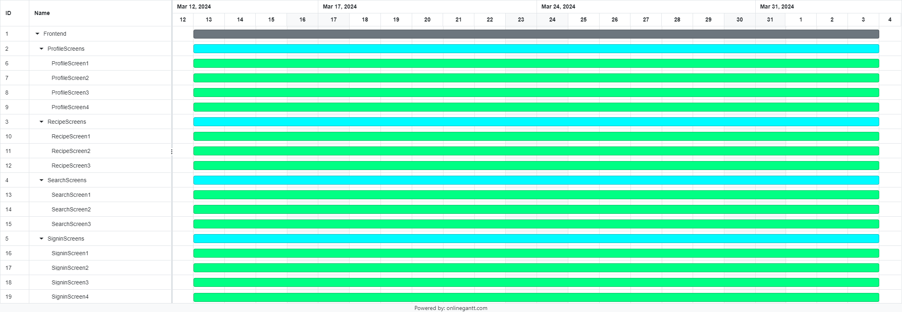
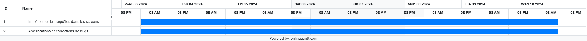

<h1 align="center">
   <b>
         
    </b>
</h1>

# Développeurs

 |  |  |  |
--- | --- | --- | --- |
Codeur | Chef de projet | Codeur | Chercheur |
CORNEJO, Oscar, 22305517 | KASHI, Mohand-Hedi, 220051070 | MOUSSSAOUI, Iness, 22006171 | JOLY, Thomas, 21916099 |

# Description

Projet dans lequel on veut implémenter un site web permettant de partager ses recettes de cuisine avec les autres utilisateurs. De nombreux paramètres de recherches sont disponibles pour effectuer des recherches précises (prix, quantité, temps, allergie) . Le site aura aussi un espace commentaire permettant de partager ses différents avis sur les différents espaces disponibles aux utilisateurs . Chaque semaine le site affiche une recette de la semaine permettant de faire découvrir de nouvelles recettes aux utilisateurs.

# Table de contenu

- [Développeurs](#développeurs)
- [Description](#description)
- [Table de contenu](#table-de-contenu)
  - [Description de l'application](#description-de-lapplication)
  - [Progrès réalisés à ce jour](#progrès-réalisés-à-ce-jour)
  - [Références](#références)
  - [Problèmes rencontrées/solutions trouvées](#problèmes-rencontréessolutions-trouvées)
  - [Mise à jour du calendrier](#mise-à-jour-du-calendrier)
  - [Rôles pour le prochain sprint](#rôles-pour-le-prochain-sprint)

## Description de l'application

Nous avons décidé de créer un site web de recettes de cuisine qui permettra aux utilisateurs de pouvoir trouver des recettes adaptées selon leurs envies et leurs finances . Pour cela nous avons personnifié les paramètres disponibles pour une meilleure utilisation pour les utilisateurs (prix, ingrédients , temps, ..) . Nous avons immédiatement pensé au côté partage, en créant une partie réseaux sociaux ou les gens qui sont identifiés sur le site web pourront commenter, partager et communiquer leurs recettes .

Nous avons d’abord cherché un symbole pour représenter notre site. Pour trouver une image libre de droits, nous avons utilisé l'IA Microsoft Copilot qui nous a donné un design sans copyright.

## Progrès réalisés à ce jour

Nous avons finalisé l'implémentation de tout le frontend des pages de notre site de recette de cuisine. 

Pour les sections Inscriptions et Connexions nous avons implémenté les “screens” suivantes : SignInScreen1 , SignInScreen2,  SignInScreen3 et SignInScreen4, SignInScreen5. Nous avons mis en place dans le 1 une page permettant l'accès aux comptes des utilisateurs déjà inscrits . De plus sur cette première page il y a un lien permettant de rejoindre la page inscription pour permettre l'inscription aux nouveaux utilisateurs. Nous avons du finalement créer 2 autres screens pour gérer les Mot de passe oubliés des utilisateurs déjà inscrits . Le premier permet d’envoyer un email sur l’adresse mail enregistrée du compte et ensuite la page va demander le code secret qui a été émis à l’adresse associée  et la deuxième page permet d’entrer le code secret  émis à cette adresse. Enfin après avoir entrer  le code secret valide la derniere page (4) va s'exécuter afin de permettre à l'utilisateur de modifier son mot de passe 

Après avoir fait le ”log in”. On affiche les principaux tabs de l'application à partir d’un navigateur entre eux. Ce dernier se compose de trois sections : Chercher , Recettes et Profil.

Pour les sections Chercher et Recettes nous avons implémenté les pages SearchScreen1, SearchScreen2 et SearchScreen3, et RecipeScreen1, RecipeScreen2 et RecipeScreen3 respectivement, ainsi que la mise en place des routes pour faciliter la navigation des utilisateurs. Lorsque les utilisateurs accèdent à SearchScreen1, ils sont accueillis par un moteur de recherche où ils peuvent chercher des recettes en utilisant un tag ou une recherche avancée. En cliquant sur Chercher ou le bouton loupe, ils sont dirigés vers les recettes associées. D'un autre côté, lorsque les utilisateurs accèdent à RecipeScreen1, ils sont accueillis par une variété de catégories. En cliquant sur une catégorie spécifique, ils sont instantanément dirigés vers les recettes associées. Ensuite, SearchScreen2 et RecipeScreen2 affichent les résultats des recettes associées soit à la recherche ou soit à la catégorie sélectionnée avec un “flat list” composé par des composants RecipeCard. En cliquant sur chaque RecipeCard, on est dirigé vers SearchScreen3 ou RecipeScreen3 selon le cas, ces “screens” nous proposent ensuite une vue détaillée des étapes de préparation, des ingrédients nécessaires, un espace où on peut laisser un commentaire sur la recette et même des commentaires pertinents laissés par d'autres utilisateurs. 

Concernant la section Profile, nous avons implémenté les pages ProfileScreen1, ProfileScreen2, ProfileScreen3 et ProfileScreen4. Le ProfileScreen1 correspond à la page utilisateur, un utilisateur peut y consulter les recettes qu’il a publiées, supprimer des recettes qu’il a publiées en cliquant sur la poubelle ou bien les modifier en cliquant sur le bouton “Modifier”. Il peut aussi accéder aux paramètres du profil en cliquant sur le bouton “paramètres du profil”, d’où il peut modifier ses informations personnelles ainsi que son mot de passe. ProfileScreen2 correspond à la page permettant à un utilisateur de modifier ses informations personelles. ProfileScreen3 correspond à la page à partir de laquelle un utilisateur peut modifier son mot de passe. ProfileScreen4 correspond à la page de publication/modification de recette.

Lien vers le site de design en Figma:

https://www.figma.com/file/3tYEf26leCO5v0TsYompBH/CookApp?type=design&node-id=0-1&mode=design&t=hq0dGaHQoiCk5l1P-0/

## Références 

https://reactrouter.com/en/main 

https://developer.mozilla.org/en-US/docs/Learn/JavaScript/Objects/JSON 

https://github.com/ 

https://mongoosejs.com/docs/guide.html 

https://react.dev/reference/react 

https://chat.openai.com/

https://www.figma.com/file/3tYEf26leCO5v0TsYompBH/CookApp?type=design&node-id=0-1&mode=design&t=hq0dGaHQoiCk5l1P-0/

## Problèmes rencontrées/solutions trouvées

Dans la page “Changer le mot de passe”, les variables ayant été déclarées avec “React.useState()” ne contiennent pas les dernières versions des valeurs, c’est pourquoi on a utilisé “React.useEffect()” pour contourner ce problème.

On a rencontré des problèmes dans la navigation entre “screens” en utilisant des composants de la bibliothèque react-router-dom, surtout dans la partie de redirection vers d’autres “screens” et export de paramètres entre “screens”. C'est pour cela qu’on a trouvé des informations sur la bibliothèque react-route-dom pour savoir comment gérer ce type de problèmes et au final standardisé le format de navigation de chaque “tab”.

Il y a eu quelques changements dans le code du frontend par rapport au design qui ont été dû modifiés, car l’esthétique a été perdue en modifiant la taille d’écran dans le cas de SearchScreen2 et RecipeScreen2.

On a également rencontré des problèmes pour trouver un dataset pour les recettes qui correspond à nos intérêts, donc c’était nécessaire de créer un fichier .json avec des données de recettes en utilisant l’IA ChatGPT.

## Mise à jour du calendrier

## Rôles pour le prochain sprint

Chef de projet: Joly Thomas

Codeurs : Moussaoui Iness, Kashi Mohand-Hedi

Chercheur : Cornejo Oscar
