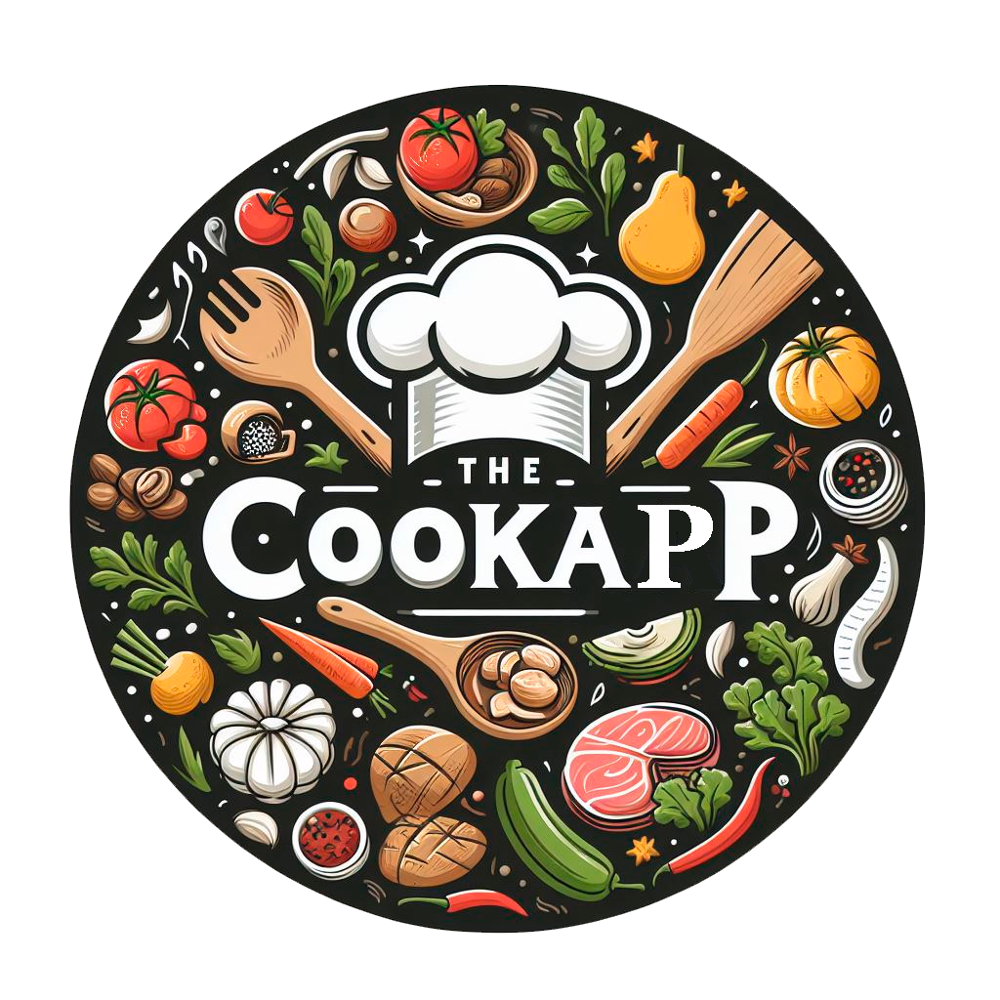

<h1 align="center">
   <b>
         
    </b>
</h1>

# Développeurs

 |  |  |  |
--- | --- | --- | --- |
Chercheur | Codeur | Codeur | Chef de projet |
CORNEJO, Oscar, 22305517 | KASHI, Mohand-Hedi, 220051070 | MOUSSSAOUI, Iness, 22006171 | JOLY, Thomas, 21916099 |

# Description

Projet dans lequel on veut implémenter un site web permettant de partager ses recettes de cuisine avec les autres utilisateurs. De nombreux paramètres de recherches sont disponibles pour effectuer des recherches précises (prix, quantité, temps, allergie) . Le site aura aussi un espace commentaire permettant de partager ses différents avis sur les différents espaces disponibles aux utilisateurs . Chaque semaine le site affiche une recette de la semaine permettant de faire découvrir de nouvelles recettes aux utilisateurs.

# Table de contenu

- [Développeurs](#développeurs)
- [Description](#description)
- [Table de contenu](#table-de-contenu)
  - [Description de l'application](#description-de-lapplication)
  - [Progrès réalisés à ce jour](#progrès-réalisés-à-ce-jour)
  - [Références](#références)
  - [Problèmes rencontrées/solutions trouvées](#problèmes-rencontréessolutions-trouvées)
  - [Mise à jour du calendrier](#mise-à-jour-du-calendrier)

## Description de l'application

Nous avons décidé de créer un site web de recettes de cuisine qui permettra aux utilisateurs de pouvoir trouver des recettes adaptées selon leurs envies et leurs finances . Pour cela nous avons personnifié les paramètres disponibles pour une meilleure utilisation pour les utilisateurs (prix, ingrédients , temps, ...) . Nous avons immédiatement pensé au côté partage, en créant une partie réseaux sociaux ou les gens qui sont identifiés sur le site web pourront commenter, partager et communiquer leurs recettes .

Nous avons d’abord cherché un symbole pour représenter notre site. Pour trouver une image libre de droits, nous avons utilisé l'IA Microsoft Copilot qui nous a donné un design sans copyright.

## Progrès réalisés à ce jour

Nous avons continué la connexion entre le backend et le frontend. Nous avons ajouté les routes manquantes pour passer d’une Tab a une autre sans expérimenter de conflits de routes introuvables. 

On peut faire la recherche de recettes à partir d’une recherche basée sur un moteur de recherche qui correspond à l’attribut “tab” des recettes, ou bien on peut le faire de manière avancée en remplissant un formulaire de recherche selon des autres attributs des recettes. Nous pouvons également personnaliser notre recette en entrant la quantité de personnes pour laquelle on veut que la recette s’adapte. Lorsque on obtient les résultats de la recherche on peut naviguer vers l’information sur les étapes de préparation et des ingrédients pour chaque recette en ayant aussi la possibilité de regarder les commentaires et les notes laissés par les utilisateurs et faire un commentaire et donner une note nous-mêmes.
 
Pour la connexion entre le backend et le frontend pour la Tab recette lorsque l’on clique sur un boutons dans une catégorie on obtient bien des recettes associées à la bonne catégorie. 

On peut maintenant publier une recette depuis l’onglet Profile et modifier/supprimer les recettes que l’on a déjà publiées. On peut aussi modifier les informations personnelles de l’utilisateur et changer le mot de passe. 

Lien vers le site de design en Figma:

https://www.figma.com/file/3tYEf26leCO5v0TsYompBH/CookApp?type=design&node-id=0-1&mode=design&t=hq0dGaHQoiCk5l1P-0/

## Références 

https://github.com/ 

https://mongoosejs.com/docs/guide.html 

https://react.dev/reference/react 

https://ultimatecourses.com/blog/navigate-to-url-query-strings-search-params-react-router 

https://reactrouter.com/en/main/hooks/use-params 

https://www.oracle.com/fr/cloud/ 

https://www.figma.com/file/3tYEf26leCO5v0TsYompBH/CookApp?type=design&node-id=0-1&mode=design&t=hq0dGaHQoiCk5l1P-0/

## Problèmes rencontrées/solutions trouvées

- Problèmes rencontrées : Lorsque l’on veut mettre une recette en favoris cette dernière apparaît en double. 
Lors du setup du serveur, beaucoup de problèmes ont été rencontrés, nous continuerons cette partie dans la semaine à venir.

- Solution :  pas encore trouvé, nous travaillons actuellement dessus.

## Mise à jour du calendrier

